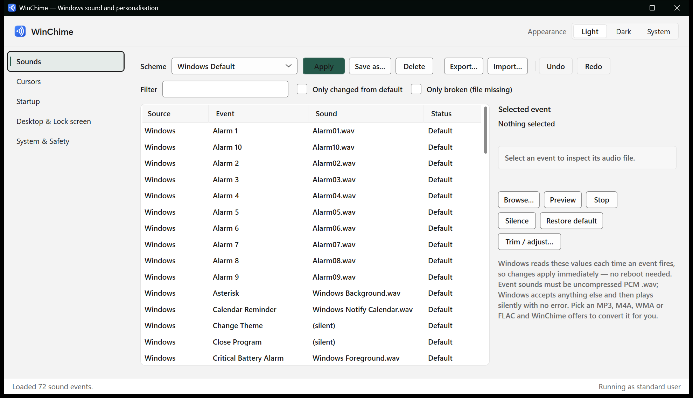
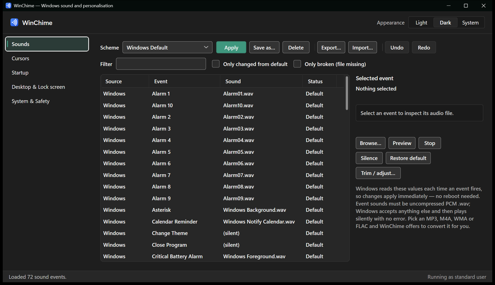
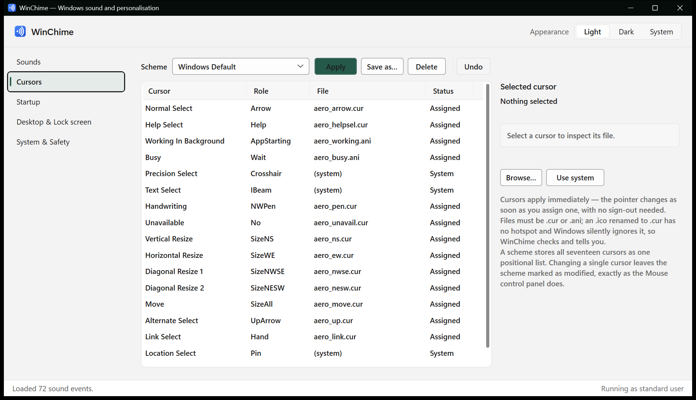
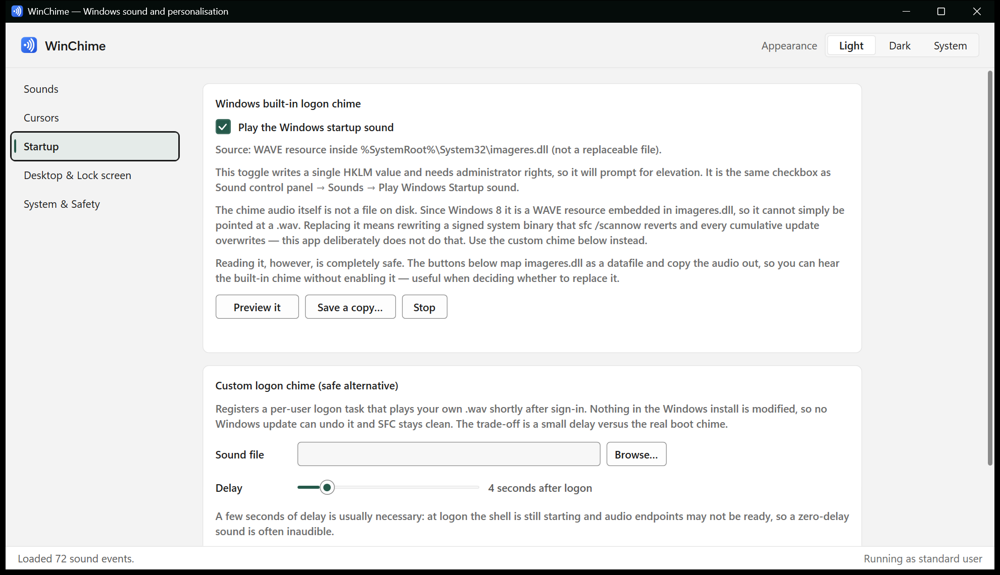
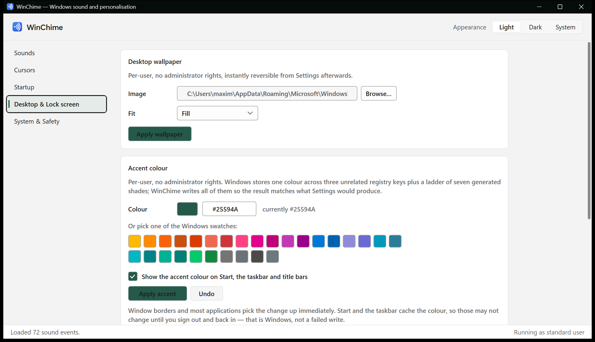
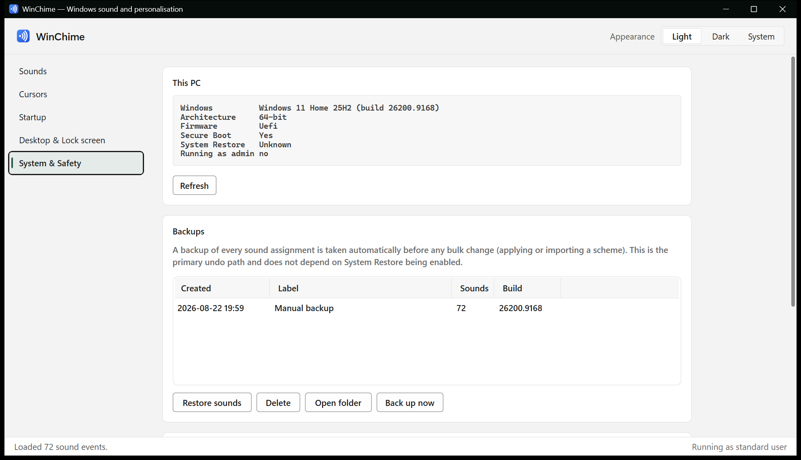

# WinChime

[](https://github.com/maximtz13/WinChime/actions/workflows/ci.yml)
[](LICENSE)

One application for Windows sound and startup personalisation: system event sounds, sound
schemes, cursors, the logon chime, wallpaper, the accent colour and the lock screen.

It has a light and a dark theme, follows the Windows theme by default, and
[tints itself with your accent colour](#the-apps-own-appearance--themeservice--accenttheme) —
picking a shade of it that keeps its own labels readable whichever accent you have set.

**Nothing here modifies a system file, a boot file, or the firmware trust chain.** Every
change is either per-user or a single documented registry value, and every change is
reversible from inside the app. See [Scope](#scope) for what was deliberately left out and
why.



The same window in the dark theme. The green is not a WinChime colour — it is this machine's
Windows accent, which the app reads and tints itself with.



<details>
<summary><b>More screenshots</b> — Cursors, Startup, Desktop &amp; Lock screen, System &amp; Safety</summary>

### Cursors

All seventeen cursor roles, with the scheme each came from and whether the file behind it
actually exists.



### Startup

Preview the built-in Windows chime without enabling it, or install your own via a per-user
logon task.



### Desktop and lock screen



### System and safety



</details>

---

## Risk tiers

| Tier | What | Admin | Risk | Status |
|------|------|-------|------|--------|
| 1 | Event sounds, sound schemes, wallpaper | No | None. Per-user registry, instantly reversible. | **Implemented** |
| 2a | Windows logon chime on/off | Yes | Minimal. One HKLM DWORD. | **Implemented** |
| 2b | Custom logon chime via scheduled task | No | Minimal. Nothing in Windows is modified. | **Implemented** |
| 2c | Lock screen image | Yes | Low, but *greys out* the Settings page while applied. | **Implemented** |
| — | Preview/extract the built-in chime | No | None. Read-only resource read. | **Implemented** |
| — | Custom chime by patching `imageres.dll` | Yes | Reverted by `sfc` and by every cumulative update. | **Rejected by design** |
| — | UEFI boot logo (BGRT) | Yes | Requires disabling Secure Boot. | **Rejected by design** |

## Scope

Two things this app could technically do and deliberately does not:

**Patching `imageres.dll` to replace the startup chime.** It means taking ownership from
TrustedInstaller and rewriting a signed system binary, which `sfc /scannow` reverts and
every cumulative update overwrites. The scheduled-task approach below achieves the same
user-visible result with none of that.

**Replacing the UEFI boot logo.** It requires the user to disable Secure Boot (or self-sign
an EFI loader and enrol the key), and to suspend BitLocker first or land at a recovery-key
prompt. Talking people into weakening their machine's firmware trust chain for a cosmetic
change is not a trade worth offering, so the feature — and all the gating code that existed
to support it — was removed rather than shipped behind a warning.

---

## What each feature actually does

### Event sounds and schemes — `SoundSchemeService`

The whole Windows event-sound system is `HKCU\AppEvents`:

```
AppEvents\Schemes                              (Default) = active scheme key
AppEvents\Schemes\Names\{scheme}               (Default) = friendly scheme name
AppEvents\Schemes\Apps\{app}\{event}\.Current  (Default) = active wav path
AppEvents\Schemes\Apps\{app}\{event}\.Default  (Default) = the original Windows wav
AppEvents\Schemes\Apps\{app}\{event}\{scheme}  (Default) = that scheme's wav
AppEvents\EventLabels\{event}                  (Default) = friendly event name
```

Per-user, no elevation, and Windows re-reads the value each time an event fires — so
changes apply immediately with no reboot and no `WM_SETTINGCHANGE` broadcast.

Because `.Default` is stored per event, **restore-to-Windows-default is free** and does not
depend on our own backups.

Three things this does that the Sound control panel does not:

- **Validates the WAV.** Windows accepts any file and then plays *nothing* if it is not
  uncompressed PCM — no error, no log entry. `WaveFile` parses the RIFF header and says so.
- **Converts what will not work.** Detecting the problem is only half an answer. Pick an
  MP3, M4A, WMA or FLAC and `AudioTranscoder` offers to convert it to PCM WAV, writing the
  copy to `%LOCALAPPDATA%\WinChime\converted` — a persistent location, because the registry
  points at it and a temp folder would leave every converted sound broken after a reboot.
  Decoding goes through Media Foundation, so the readable formats are whatever the host
  Windows supports.
- **Trims and evens out volume, on request.** Both alter the audio, so neither happens
  silently — the conversion dialog asks, and trim is pre-ticked only when the source is
  genuinely too long for an event sound. Trimming applies a short fade at the cut, because
  slicing mid-waveform leaves a discontinuity that is audible as a click. Normalisation is
  peak-based with a gain ceiling, so a near-silent clip does not get its noise floor hauled
  up into audibility. *Trim / adjust…* applies the same processing to a sound that already
  works.
- **Flags broken assignments.** A sound pointing at a deleted file also fails silently.
  The Status column shows `Missing`.

### Sound packs — `SoundPackService`

Two export formats, because they solve different problems:

| Format | Contents | Use when |
|---|---|---|
| `.winchime.json` | Registry paths only | Backing up or moving between your own machines |
| `.winchimepack` | Scheme **plus the audio**, one zip | Sending a scheme to someone else |

A bare `.json` scheme stores *unexpanded* registry values so `%SystemRoot%` resolves
correctly anywhere — but it only works on a machine that already has identical files at
identical paths, which in practice means it does not travel. A pack is one file you can
hand to someone.

Two things a pack deliberately does **not** contain:

- **Windows' own sounds.** An assignment pointing at `%SystemRoot%\media\...` is kept as
  that literal string. Those files exist on every Windows install, so bundling them would
  bloat the pack and redistribute Microsoft's audio for no benefit.
- **Duplicates.** One file referenced by twelve events is stored once and referenced twelve
  times.

#### The included pack

[`packs/WinChime Chime.winchimepack`](packs) is a complete set covering notifications,
errors, device connect and disconnect, logon and logoff, and emptying the recycle bin.
Install it from the app with *Import…*, or:

```bash
WinChime.exe --apply-pack "packs\WinChime Chime.winchimepack"
```

Every sound is **synthesised**, not sourced, so the pack carries no third-party licensing
and is reproducible from `tools/SoundPackGenerator`. They are additive synthesis — a few
sine partials over an exponential decay, which is genuinely how a lot of UI sounds are made
— built from one pentatonic set, so any two heard together still sound intentional.

Two details that are audible if you get them wrong: partials must decay at *different* rates
or the result sounds like an organ rather than something struck, and every sound needs a
short attack ramp and end fade, because a non-zero sample at either edge of the file is a
click. Committed sounds are verified to start and end at exactly zero.

The pack is also checked by CI. Tests install the committed artefact, confirm every
assignment resolves to a file that exists, and confirm every sound is playable PCM — the
same standard the app enforces on your input. A pack whose manifest references missing media
would install "successfully" and then be silent, which is precisely the failure this project
exists to prevent.

Installing validates before extracting. Entry paths are checked so a hostile entry named
`../../evil.exe` cannot write outside the pack folder — packs are files people receive from
other people, so that is a real attack surface rather than a theoretical one — and entry
count and total uncompressed size are bounded against zip bombs. Missing or dangling
entries are reported rather than silently assigned.

### Cursors — `CursorSchemeService`

`HKCU\Control Panel\Cursors` is structurally close to the sound system, so the scheme model,
validation, snapshot and undo patterns all carried over. Unlike sounds it ships with content
already: Windows includes a dozen cursor schemes.

One difference drove most of the design. **A cursor scheme is a single comma-separated
string where meaning comes entirely from position**, not a subkey per role. Get the order
wrong and every cursor silently becomes the wrong one. The order in `CursorRoles.All` was
derived by reading the shipped Windows Aero scheme and cross-referencing each entry against
the live `HKCU` values — index 2 is `AppStarting` and index 3 is `Wait` because
`aero_working.ani` and `aero_busy.ani` sit exactly there. A test pins it.

Three related traps, each handled:

- **The role list is an allow-list, not an enumeration of the key.** That key also holds
  `CursorBaseSize`, `Scheme Source` and gesture settings; treating those as assignable
  cursors would corrupt the mouse configuration.
- **Shipped schemes have 19 entries, not 17.** The last two are a control panel icon path
  and index — display metadata, ignored on read and omitted on write.
- **Writing the registry changes nothing on screen.** `SPI_SETCURSORS` is what actually
  swaps the pointer, and a failure there is reported rather than silently succeeding.

`CursorFile` rejects an `.ico` renamed to `.cur`: same layout, type field 1 instead of 2, no
hotspot. Windows accepts the assignment and silently keeps the system cursor — the same
class of quiet failure as a non-PCM wav.

Status reads **Assigned** rather than "Custom". Windows records no per-role default for
cursors, unlike sounds, so there is no way to distinguish a file the user chose from one
that came with the active scheme, and claiming otherwise would mislabel every stock cursor.

### The logon chime — `StartupSoundService` / `LogonChimeService`

The on/off switch is one HKLM DWORD:

```
HKLM\SOFTWARE\Microsoft\Windows\CurrentVersion\Authentication\LogonUI\BootAnimation
    DisableStartupSound  (REG_DWORD)  0 = play, 1 = silent
```

A machine policy at `...\Policies\System\DisableStartupSound` overrides it, and the UI says
so when one is present.

**The chime audio is not a file.** Since Windows 8 it is a WAVE resource embedded in
`%SystemRoot%\System32\imageres.dll` — resource `#5080` on current builds.

**You can still hear it.** `SystemChimeResource` maps the module with
`LOAD_LIBRARY_AS_DATAFILE` and copies the audio out, so *Preview it* / *Save a copy* work
without elevation, without executing anything from the DLL, and without writing to it.
Rather than hard-coding `5080`, the WAVE resources are enumerated and whatever is actually
there is used, which survives Microsoft renumbering it.

To *replace* it, turn the built-in chime off and register a per-user logon scheduled task
that runs `WinChime.exe --play-chime "<path>"`. Nothing in the Windows install is modified,
so no update can undo it and SFC stays clean. The trade-off is a second or two of latency.

A delay slider matters more than it looks: at logon the shell is still starting and audio
endpoints may not be ready, so a zero-delay sound is frequently inaudible. Default is 4s.

Registered through `schtasks.exe` with an XML definition rather than the Task Scheduler COM
API — a one-off registration does not justify another dependency, and the XML is
inspectable by anyone wondering what runs at their logon. Note `schtasks` requires the XML
file to be **UTF-16**; UTF-8 is rejected with an unhelpful parse error.

### Accent colour — `AccentColorService`

One colour, three unrelated HKCU keys, and no documentation for any of it. Windows stores
the accent in `Explorer\Accent` (a palette plus two derived values), `DWM` (twice, in two
different byte orders), and `Themes\Personalize`.

**The registry alone is not trustworthy here.** On the machine this was built against,
`DWM\AccentColor` held a stale blue while the accent actually in use was green. What
resolved it was cross-checking against `Windows.UI.ViewManagement.UISettings` — the API
Windows answers accent questions with. That showed `AccentPalette` maps exactly onto the
`UIColorType` ladder:

```
[0] AccentLight3   [3] Accent  <- the real value   [5] AccentDark2
[1] AccentLight2   [4] AccentDark1                 [6] AccentDark3
[2] AccentLight1                                   [7] fixed sentinel, alpha 0, not a colour
```

So the accent is read from `AccentPalette[3]`, never from DWM.

The shade ladder turns out to be a plain multiplicative scale of the accent, which preserves
hue and saturation exactly. Verified against the live palette:

```
worst channel difference across the whole ladder: 1/255
4 of 7 shades exact
AccentColorMenu and StartColorMenu: exact
```

Being an approximation of an undocumented algorithm, a tint may occasionally land one value
off what Settings would produce. That is cosmetic.

Multiplying breaks near white — channels clamp unevenly and the hue drifts toward grey — so
above the available headroom the colour is blended toward white instead. A light blue
lightens into a paler blue rather than washing out.

Writing the registry changes nothing on screen until running applications are told to
re-read it, so the change is broadcast. Window borders and most apps update immediately;
**Start and the taskbar cache the colour and may need a sign-out.** The app says so, because
otherwise it reads as a failed write.

### Lock screen — `LockScreenService`

There is no clean option here for an unpackaged desktop app:

- `Windows.System.UserProfile.LockScreen.SetImageFileAsync` requires package identity. An
  unpackaged `.exe` cannot call it, and MSIX-packaging the app for that one call is not
  worth it.
- `HKLM\SOFTWARE\Policies\Microsoft\Windows\Personalization\LockScreenImage` is ignored on
  Windows Home.

So it uses **PersonalizationCSP**, the MDM route, which works on all editions:

```
HKLM\SOFTWARE\Microsoft\PolicyManager\current\device\Personalization
    LockScreenImagePath / LockScreenImageUrl / LockScreenImageStatus
```

The cost is real and the UI states it up front: **while applied, the lock screen section of
Settings is greyed out.** *Clear override* fully removes it.

The chosen image is copied into `%ProgramData%\WinChime\LockScreen` rather than referenced
in place, because a lock screen pointing at a deleted file in someone's Downloads folder
degrades badly.

### Wallpaper — `WallpaperService`

The easy one. `SystemParametersInfo(SPI_SETDESKWALLPAPER)` plus the
`WallpaperStyle`/`TileWallpaper` pair in `HKCU\Control Panel\Desktop`. Per-user, no
elevation, no policy, fully reversible from Settings.

### The app's own appearance — `ThemeService` / `AccentTheme`

Light, dark, or follow Windows, switched from the header and remembered in
`HKCU\Software\WinChime`. Following Windows is live: change the system theme with WinChime
open and it moves with it, via a `RegistryWatcher` on the Personalize key.

Three things here were less obvious than they look.

**It reads `AppsUseLightTheme`, not `SystemUsesLightTheme`.** Those are independent settings —
a dark taskbar with light apps is a normal configuration that Settings offers directly — so an
app reading the system value looks wrong on every machine set that way. A *missing* value means
light, not unknown: on an install where nobody has opened the theme settings the value does not
exist and Windows renders light.

**The title bar is not WPF's to draw.** WPF owns the client area and DWM owns the caption, so a
dark window with a default caption gets a bright white cap across the top.
`DWMWA_USE_IMMERSIVE_DARK_MODE` fixes it, but the attribute number moved: 20 from Windows 10
20H1, 19 on builds between 18362 and 19041, and on those the two numbers mean different things.
`TitleBarTheme` tries 20 and falls back to 19 only when DWM rejects it, which avoids guessing
from a build number.

**The app tints itself with your accent** — fitting for an app whose job is editing that accent,
but the accent is not a colour the app gets to pick. Windows' swatches run from `#FFB900` to
`#4C4A48`, and every obvious rule fails somewhere on that list. A fixed white foreground fails
on eleven of the twenty-eight (1.72:1 on the yellow). A fixed shade with a fixed foreground,
which is what Windows itself does, bottoms out at 2.68:1. Taking whichever of black or white
scores higher passes everywhere but picks black on eighteen, including the classic `#0078D7`
where white is 4.50 and black is 4.67 — close enough that two near-identical reds end up with
opposite treatments, which reads as a bug rather than a decision.

So the foreground is fixed by convention, white on light and black on dark, and the *fill*
moves: the accent is used exactly as chosen when it can carry that text, and otherwise walks
the existing shade ladder away from the foreground until it can. Measured across all twenty-eight
swatches that clears AA in both themes with no exceptions, keeps every fill at least 3:1 against
its page, and never blows a saturated accent out to plain white. `AccentThemeTests` pins all
three, and sweeps the colour cube for hand-typed values as well.

High contrast bypasses the whole palette and defers to `SystemColors`. Someone running a high
contrast scheme chose those colours deliberately, usually because they need them.

---

## Safety design

**Undo and redo for anything you change.** `SoundEditHistory` stores diffs rather than
snapshots, so a single assignment records one key while a scheme apply records only the
events it actually changed — one mechanism for both. Restoring a backup is itself undoable,
so a mis-clicked restore does not send you hunting through the backup list. Bounded at 100
entries; in-session only.

**Applying a scheme is atomic.** It writes to dozens of keys, so it snapshots first and
rolls back if anything fails part-way. The error distinguishes "failed, your sounds were put
back" from "failed, and the recovery also failed" — materially different situations, and
conflating them would be dishonest.

**The list does not silently go stale.** `RegistryWatcher` uses `RegNotifyChangeKeyValue` on
`HKCU\AppEvents`, so changes made by the Sound control panel or another tool show up here.
Notifications are one-shot and must be re-armed; getting that wrong yields a watcher that
fires once then goes quiet, which is worse than none because it looks like it works. There
is a test specifically for that failure mode. If the watcher cannot arm, the app says so
rather than leaving you trusting a stale view.

**Automatic backups before every bulk change.** `BackupService` snapshots all sound
assignments to `%LOCALAPPDATA%\WinChime\backups\{id}\manifest.json` before applying or
importing a scheme. Not conditional on a checkbox. This is the *primary* undo path and
works on machines where System Restore is disabled — which is most consumer Windows 11
installs.

Backups are registry-only by design. Since no system file is ever modified, a few KB of
JSON is a complete record of everything the app changed; there is no file-copy or hashing
path because there is nothing to copy.

**System Restore as a backstop, not the plan.** `RestorePointService` reports honestly
that it needs elevation, needs System Restore enabled for the system drive, and that
Windows only creates one point per 24 hours unless policy says otherwise — so a second call
the same day silently does nothing.

**Least-privilege elevation.** The UI runs `asInvoker` for the whole session. The handful
of privileged operations run in a short-lived elevated copy of the same exe
(`--elevated-op`), which does exactly one operation from a closed enum and exits. Request
and response travel through temp files, not the command line, so a path containing quotes
cannot be mis-parsed into a different operation. The alternatives were worse: a
`requireAdministrator` manifest runs the entire UI elevated just to flip one DWORD, and a
persistent elevated helper service is far more attack surface than a personalisation tool
deserves.

---

## Install

Grab a build from [Releases](https://github.com/maximtz13/WinChime/releases):

| File | Size | Requires |
|------|------|----------|
| `WinChime-<version>-win-x64.zip` | ~0.3 MB | [.NET 8 Desktop Runtime](https://dotnet.microsoft.com/download/dotnet/8.0) |
| `WinChime-<version>-win-x64-self-contained.zip` | ~155 MB | nothing, fully standalone |

The binaries are unsigned. See [Windows may block it on first run](#windows-may-block-it-on-first-run)
before you assume something is broken.

## Windows may block it on first run

Two different mechanisms, with two different answers.

### SmartScreen — "Windows protected your PC"

A blue dialog you can dismiss: **More info → Run anyway**. It appears because the binary is
unsigned and has no download reputation yet.

### Smart App Control — a hard block

On Windows 11 installs where Smart App Control is enabled, the app may be blocked outright
rather than warned about. In logs it surfaces as
`An Application Control policy has blocked this file (0x800711C7)`, with Code Integrity
events 3077/3033/3118 naming policy `VerifiedAndReputableDesktop`.

**Wait and try again.** SAC's verdict comes from a cloud reputation service, and a binary it
has never seen is blocked until that check completes. Observed during development: a freshly
built assembly was blocked, and the same file ran normally a short time later with no
intervention at all.

**Do not turn Smart App Control off to work around this.** Disabling it is **irreversible** —
re-enabling requires resetting or reinstalling Windows. That is a permanent reduction in your
machine's security to run one personalisation utility, and it is a bad trade.

Check your state with:

```bash
Get-ItemProperty HKLM:\SYSTEM\CurrentControlSet\Control\CI\Policy
```

`VerifiedAndReputablePolicyState` of `1` means Enforce, `2` Evaluation, `0` Off.

### Where code signing does and does not help

The obvious response is "just sign it". That does not fix *this*, but the reason is more
interesting than a flat no.

**Signing buys no instant trust.** SAC checks reputation first and the certificate chain
second, so an unknown-reputation binary is blocked **even when correctly signed**.
SmartScreen behaves the same way: per Microsoft, a valid OV or EV certificate still produces
an "unrecognized app" warning until reputation accumulates. Note also that **EV certificates
no longer bypass SmartScreen** — they did years ago, and Microsoft now says paying the EV
premium solely to avoid warnings is no longer justified.

**But signing is the only way reputation ever compounds.** This is the argument that
actually matters, and it is easy to miss:

> When a file is not signed, SmartScreen reputation must build for each new version of your
> files, starting with zero reputation. Reputation cannot transfer from previous versions
> unless both were signed using the same publisher identity.

Unsigned, every release starts from nothing, forever — v0.2.0 inherits none of v0.1.0's
history. Signed, reputation accrues to the *certificate* and carries across versions. So
signing is not a fix for today's block; it is the difference between reputation that
accumulates and reputation that resets on every release.

WinChime is unsigned today because at zero users there is nothing to compound yet. The point
to revisit is when releases are frequent enough that restarting from zero each time is the
binding constraint.

### If you are building from source

The same applies — building locally does **not** avoid it. `dotnet test` can fail to load a
freshly built assembly even though the build succeeded, because the output has a new hash
that SAC has never seen. Retrying after a short delay generally works. CI is unaffected, as
GitHub's runners do not have SAC.

## Build and run

Requires the **.NET 8 SDK**:

```bash
winget install Microsoft.DotNet.SDK.8
```

Then, from the repo root:

```bash
dotnet build WinChime.sln -c Release
```

```bash
dotnet run --project src/WinChime.App
```

```bash
dotnet test WinChime.sln -c Release
```

### Tests

`tests/WinChime.Core.Tests` covers the registry layer, WAV validation, and scheme
import/export. Two decisions worth knowing:

**No registry mocking.** `SoundSchemeService` takes an HKCU root, and tests point it at a
throwaway `Software\WinChime.Tests\{guid}` subtree. Registry semantics are exactly where
the bugs live here — REG_SZ versus REG_EXPAND_SZ, default values on subkeys,
delete-subkey-tree behaviour — and a mock would only assert our assumptions about those
rather than the truth. Each test's subtree is removed on dispose and your real sound
settings are never touched. The shared `HKCU\Software\WinChime.Tests` parent key and the
matching TEMP folder are deliberately left in place: deleting them the moment they look
empty races with another test class creating its own subtree underneath, which caused
intermittent failures. An empty key is a smaller problem than a flaky suite.

**No binary fixtures.** WAV files are synthesised per test, so a case can state the
property it cares about (2.5 seconds long, MP3-in-a-WAV-container) instead of a reader
having to open a blob to find out what makes it interesting.

To produce a single self-contained exe:

```bash
dotnet publish src/WinChime.App -c Release -r win-x64 --self-contained false -p:PublishSingleFile=true
```

### Layout

```
src/WinChime.Core/          class library, no UI, zero NuGet dependencies
  Model/                    SoundEvent, SystemInfo, BackupManifest, OperationResult…
  Cli/                      CliRunner (the command-line surface)
  Cursors/                  CursorSchemeService, CursorFile, CursorRoles
  Sounds/                   SoundSchemeService, WaveFile, SoundPreview,
                            AudioTranscoder, SoundPackService
  Startup/                  StartupSoundService, LogonChimeService, SystemChimeResource
  Personalization/          WallpaperService, LockScreenService,
                            AccentColorService, AccentPalette,
                            ThemeService, AccentTheme, ColorContrast
  Safety/                   SystemProbe, BackupService, RestorePointService
  Elevation/                ElevationHelper  (the elevated-op protocol)
  Interop/                  NativeMethods, ProcessRunner, TitleBarTheme
src/WinChime.App/           WPF UI (net8.0-windows, asInvoker manifest)
  Theme/                    Tokens.Light / Tokens.Dark / Tokens.HighContrast
                            (identical key sets), Geometry, Controls
  ThemeManager.cs           swaps the token dictionary, tints from the accent
  Assets/WinChime.ico       app icon, generated (see below)
tools/IconGenerator/        regenerates the icon; not in the solution
tools/SoundPackGenerator/   regenerates the sound pack; not in the solution
packs/                      the included sound pack
```

The icon is generated rather than hand-drawn, and the generator is committed so the `.ico`
is reproducible instead of being an unexplained binary blob:

```bash
dotnet run --project tools/IconGenerator
```

It emits nine sizes from 16 to 256. Frames below 256 are 32-bit BGRA BMPs, because BMP is
what every shell back to XP understands. The 256 frame is PNG: that size only exists from
Vista onward and everything able to read it also reads PNG, while as a BMP it alone is
256 KB — the switch took the icon from 381 KB to 121 KB, which matters when the
framework-dependent exe is only ~0.27 MB. (The legacy `System.Drawing.Icon` API cannot read
PNG frames and falls back a size; WIC, which WPF and the shell use, reads all nine.)

Below 24 px the mark drops from three arcs to two, because a third collapses into a smudge
at that size. `IconGenerator` is deliberately excluded from `WinChime.sln` — it is a one-off
design tool, not part of the product, and CI has no reason to build it.

`WinChime.Core` targets `net8.0-windows` specifically so `Microsoft.Win32.Registry`,
`WindowsIdentity` and the Win32 P/Invokes resolve from the shared framework without package
references.

The one NuGet dependency is **NAudio 2.2.1**, used to decode audio for conversion. The
alternative was P/Invoking Media Foundation directly to keep a zero-dependency build —
several hundred lines of COM interop for the same result, and interop that is much easier
to get subtly wrong than to review. Pinned to 2.x because NAudio 3.x requires .NET 9.

> **If `dotnet test` fails to load the assembly it just built**, that is Smart App Control,
> not your checkout. See [Windows may block it on first run](#windows-may-block-it-on-first-run).

Every mutating call returns an `OperationResult` rather than throwing, so the UI can show a
precise reason (access denied, policy blocked, file missing) instead of a stack trace.

## Command line

`WinChime.exe` with no arguments opens the app. With a command it behaves like a CLI, which
makes sound configuration scriptable — applying a pack across machines rather than clicking
through a window on each one.

```bash
WinChime.exe --help
```

| Command | Effect |
|---|---|
| `--list [text]` | List sound events, optionally filtered |
| `--list-schemes` | List installed schemes, marking the active one |
| `--get <App\Event>` | Show one event, including its audio format and any warnings |
| `--set <App\Event> <file.wav>` | Assign a sound |
| `--silence <App\Event>` | Silence an event |
| `--restore-default <App\Event>` | Restore the Windows default |
| `--apply-scheme <name>` | Switch to a stored scheme |
| `--export-pack <file> [name]` | Write the current sounds to a `.winchimepack` |
| `--apply-pack <file>` | Install and apply a pack |
| `--backup [label]` | Snapshot the current assignments |
| `--list-cursors [text]` | List cursor roles, optionally filtered |
| `--list-cursor-schemes` | List cursor schemes, marking the active one |
| `--get-cursor <Role>` | Show one cursor, with its format |
| `--set-cursor <Role> <file>` | Assign a `.cur` or `.ani` |
| `--system-cursor <Role>` | Let Windows draw that cursor |
| `--apply-cursor-scheme <name>` | Switch to a cursor scheme |
| `--get-accent` | Show the accent colour and its shade ladder |
| `--set-accent <#RRGGBB> [on\|off]` | Set it; on/off shows it on Start and title bars |
| `--list-accent-presets` | List the Windows swatches |

Exit codes are `0` success, `1` failed, `2` usage error, so failures are detectable in a
script rather than needing output parsing.

Two behaviours differ deliberately from the GUI:

- **Unusable files are refused, not converted.** The app offers to convert an MP3; a script
  has nobody to ask, so the CLI fails with an explanation rather than assigning something
  Windows would accept and then play silently. Cursors are refused outright — there is
  nothing to convert.
- **Mistyped names suggest alternatives.** Keys are not memorable and a bare "not found"
  makes a CLI hostile. Matching uses **edit distance**, not substring or prefix. A prefix
  heuristic handles transpositions (`SystemHnad`) but silently fails on a deletion: `Arow`
  and `Arrow` share only two leading characters, so the most obvious typo of the most common
  cursor produced no suggestion at all. With a few dozen candidates the real computation
  costs nothing, and it is more precise — `Arow` now returns exactly `Arrow` rather than five
  near-misses.

### Why a GUI executable can print at all

WinChime is built as `WinExe` so the logon task does not flash a console window at sign-in.
The cost is that it has no console, so `Console.WriteLine` goes nowhere. `ConsoleSession`
attaches to the parent terminal and rebuilds the standard streams, because by then the CLR
has already cached a null stdout handle and output would otherwise vanish silently. Launched
without a parent console it allocates one and waits for a keypress before closing.

One quirk has no fix short of shipping a second executable: the shell prints its next prompt
as soon as it launches a GUI process, so output arrives after that prompt. Every
GUI-with-CLI app on Windows behaves this way.

### Internal switches

| Invocation | Effect |
|---|---|
| `--play-chime "<wav>"` | Plays the file synchronously and exits. Used by the logon task; never creates a window. |
| `--elevated-op "<json>"` | The elevated child spawned by `ElevationHelper`. |

Both are implementation detail, excluded from `--help`, and routed away from the CLI parser
so they can never be mistaken for user commands.

---

## Known limitations

- **Lock screen greys out Settings** while applied. Inherent to the CSP mechanism.
- **Conversion needs Media Foundation.** Absent on Server SKUs without Desktop Experience
  and on "N" editions without the Media Feature Pack. `AudioTranscoder.IsAvailable` probes
  for it and the UI degrades to a clear message rather than failing obscurely.
- **Trimming and normalising buffer the audio in memory**, capped at two minutes. Event
  sounds are seconds long, so this is far above any real input, but a longer file is cut at
  that point and the result says so rather than truncating quietly.
- **Scheme apply is not atomic.** A partial scheme leaves unlisted events untouched rather
  than silencing them, which is the safer failure mode but means "apply" is not a clean
  reset. Use *Windows Default* for that.
- **`ProductName` lies on Windows 11.** The registry value still reads "Windows 10 …" on
  every Win11 build; `SystemProbe` corrects it from the build number.
- **A light app on a dark Windows keeps a dark title bar.** The caption is DWM's, and the
  control it offers is one-directional: `DWMWA_USE_IMMERSIVE_DARK_MODE` set TRUE forces a dark
  caption, but FALSE only restores the system default, which on Windows 11 already follows the
  system theme. Verified on build 26200 — the call returns `S_OK` for both values and the
  caption stays dark. So dark-on-light looks right and light-on-dark does not. Forcing it would
  mean drawing the caption ourselves. The default *Follow Windows* setting never hits this.
- **Message boxes and file pickers stay in the system theme.** `MessageBox`, `OpenFileDialog`
  and `SaveFileDialog` are Win32 dialogs owned by the shell, not WPF windows this app can
  style, so in the dark theme they appear as light dialogs. The file pickers at least follow
  the Windows theme; `MessageBox` is a classic dialog and is light regardless, which is why it
  looks the same in every Win32 app. Routing all 42 call sites through an in-app dialog would
  fix it and is a change worth making on its own, not folded into a restyle.

## Distribution notes

- **Code signing: deliberately not done yet.** A certificate does *not* silence SmartScreen
  and does *not* satisfy Smart App Control on its own — both weigh reputation ahead of
  signature. What signing does buy is reputation that carries across releases instead of
  resetting to zero on every version. Azure Artifact Signing (formerly Trusted Signing) is
  the cheapest credible route at $9.99/month and is open to individual developers, though
  identity validation is restricted to US and Canadian applicants. Revisit when release
  cadence makes the per-version reputation reset the binding constraint.
- **There is no reputation submission process for consumer apps.** Microsoft is explicit:
  *"There is no need (or mechanism) to manually submit a file for SmartScreen reputation
  review for consumer endpoints. Reputation builds organically through download volume."*
  The Microsoft Security Intelligence portal exists for **enterprise administrators** wanting
  to accelerate trust for internal or managed deployments, and for reporting false positives.
  Neither applies here, and submitting a binary nothing has flagged would just be noise.
- **Microsoft Store.** Publishing through the Store is the one route that avoids all of this,
  because Store apps are re-signed by Microsoft and never warned about. Store policy rules out
  an app that writes the HKLM and PersonalizationCSP values used here, so sideload or direct
  download only.

## License

[MIT](LICENSE) © 2026 Maximo Martinez Jr.
